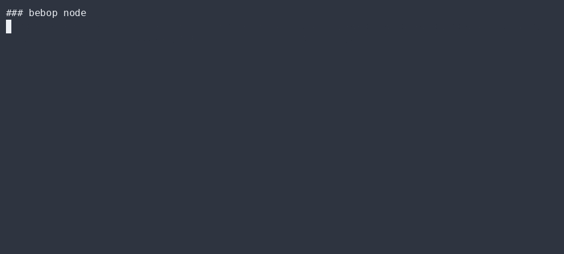

# Post-quantum identity & vault

`src/vault.rs` gives every Bebop node a **self-certifying, post-quantum** identity that
survives restarts — and fails closed on tamper. It is pure Rust (no TypeScript runtime),
built on RustCrypto + the FIPS 203/204 reference crates.

## The identity (hybrid)

Each node gets a **hybrid** key set — a post-quantum half *and* a classical half, paired
per NIST SP 800-208 (so a regression in either primitive — or in the still-unaudited PQ
crates — does not sink the node):

- **ML-KEM-768** (FIPS 203, Kyber successor) ⊕ **X25519** — concat-KEM for forward-secret key exchange.
- **ML-DSA-65** (FIPS 204, Dilithium successor) ⊕ **Ed25519** — hybrid signature.
- **Argon2id** (memory-hard) derives the AEAD key from the passphrase — replaces the old scrypt.
- **XChaCha20-Poly1305** seals the secret bundle. (AEAD confidentiality holds against a
  quantum adversary; only the symmetric nonce is classical, and it is bound to the Argon2id salt.)

The node id is **derived from the full public bundle**:

```rust
id = short_id(pq_ek ‖ pq_spk ‖ x_pub ‖ ed_pub)   // H(...) → 8-byte hex id
```

So a swapped or tampered key blob produces a *different* id → `self_certify()` refuses to
unlock. Identity is **self-certifying**: you don't need a CA to trust a node, only its
public keys.

## The vault: encrypted at rest

```rust
create_or_unlock(path, passphrase) -> Result<NodeIdentity>
unlock(path, passphrase)           -> Result<NodeIdentity>   // AEAD auth rejects wrong pass / tamper
lock(path)                         -> Result<()>
```

- The secret bundle (ML-KEM decapsulation seed ‖ ML-DSA signing seed ‖ X25519 ‖ Ed25519)
  is sealed with **XChaCha20-Poly1305**; the key is derived from the passphrase via
  **Argon2id**.
- A wrong passphrase → AEAD authentication failure → **nothing** is decrypted. Fail-closed.
- The public bundle is stored in the clear (self-certifying; the id derives from it).

## Why this matters

- **Post-quantum today** — ML-KEM + ML-DSA mean a "harvest-now-decrypt-later" attacker gets
  nothing, *and* the classical X25519/Ed25519 half keeps the node safe even if a PQ primitive
  is broken or its crate is found faulty.
- **No central directory** — nodes recognize each other by id, not by a server.
- **Falsifiable** — `vault::tests` assert (GREEN) a correct passphrase unlocks and a valid
  hybrid signature verifies, and (RED) a wrong passphrase / tampered blob / tampered id /
  truncated signature all fail closed. `doc_claims::claim_vault_roundtrip_real` exercises the
  real vault end-to-end.

## Try it

```bash
bebop node
# node id=◈a1b2c3d4 (encrypted vault .bebop/node.vault.json)
# public bundle = ML-KEM-768 ‖ ML-DSA-65 ‖ X25519 ‖ Ed25519
```

## ▶ Live CLI

> Real `bebop` output, recorded with [asciinema](https://asciinema.org) → [agg](https://github.com/asciinema/agg) (no staging, no post-editing).

**bebop node — post-quantum identity + encrypted vault**


