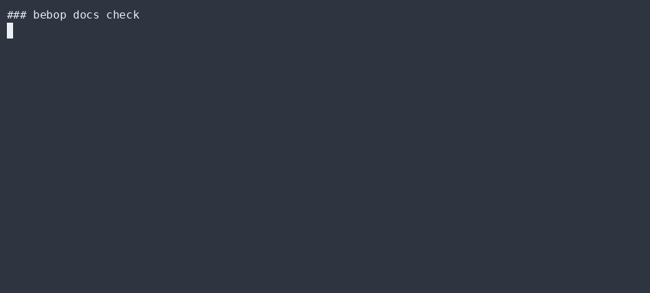

# OpenWiki — agent-facing repo wiki (auto-kept current)

> Not bundled. OpenWiki is [langchain-ai/openwiki](https://github.com/langchain-ai/openwiki),
> an open-source CLI that generates **and maintains** a structured wiki for your codebase,
> wired for coding agents. Bebop drives it through `bebop docs init|update`, and a CI job keeps
> it fresh.

## What problem it actually solves

Documentation rots. The bigger the repo, the faster `docs/` falls behind `src/`. OpenWiki flips
that: it generates a wiki into `openwiki/`, then (a) points your agent instruction file at it and
(b) ships an `--update` mode that reads `git` diffs since the last run and refreshes only what
changed. As the code moves, the wiki follows — in the background.

Bebop adds the *discipline* around it: OpenWiki is one stage of a repeatable,
**Constant-Doubt-checked** doc-release pipeline (`bebop docs build` → `bebop docs check`), not a
one-off you run and forget.

## How it's wired into Bebop

| Surface | What it does |
|---|---|
| `bebop docs init` | `npx openwiki --init` — first-generation of the wiki into `openwiki/` |
| `bebop docs update` | `npx openwiki --update` — refresh from git diffs |
| `.github/workflows/openwiki-update.yml` | daily scheduled refresh → opens a PR with the diff (no-ops without `OPENWIKI_API_KEY`) |
| `AGENTS.md` | documents `openwiki/` as the agent's first stop for durable repo context |
| `bebop docs check` | asserts `openwiki/` + the CI workflow exist before a release |

## Why this is honest

- **No magic claims.** Without an LLM key, `bebop docs init` prints exactly what to set
  (`OPENWIKI_PROVIDER` + `OPENWIKI_API_KEY`) and refuses to fabricate a wiki. The wiring is real;
  the generation needs your key (by design — OpenWiki is an LLM agent).
- **CI can't break.** The update job is gated on `secrets.OPENWIKI_API_KEY != ''`; with no key it
  silently skips, so it never red-fails your primary pipeline.
- **Wiki ≠ gospel.** `AGENTS.md` tells agents to *verify* non-trivial wiki claims against code.
  The wiki is living documentation, not an authority.

## ▶ Live CLI

`bebop docs check` — the release-readiness audit that confirms the wiki + CI are wired:



## Commands

```bash
bebop docs init     # generate openwiki/ (needs OPENWIKI_PROVIDER + OPENWIKI_API_KEY)
bebop docs update    # refresh openwiki/ from git diffs
bebop docs build     # local pipelines: typecheck, tests, wasm, diagrams, map, i18n parity
bebop docs check     # audit: gifs resolve, manifests valid, version semver, openwiki wired
```

## Gotchas

- OpenWiki stores its config/secrets in `~/.openwiki/.env` — that's user-local, never committed.
- The first run is interactive (picks provider + model). In CI, pass the env vars and it runs headless.
- The wiki PR is opened, not auto-merged — a human reviews `openwiki/` before it lands.
